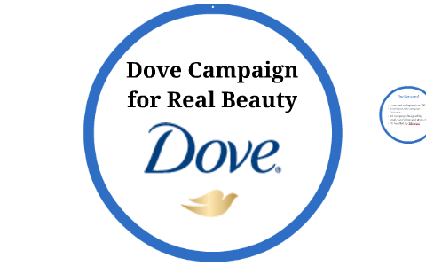

# 18. Positive Language and Phrasing

## 1. Introduction to Positive Language and Phrasing

- Positive language is a communication approach that focuses on using words and phrases that convey optimism, encouragement, and support. It emphasizes the use of affirmative and uplifting language to inspire confidence, build rapport, and foster positive relationships. In this introduction, we'll explore the significance of positive language in communication, the psychological principles underlying its impact, and the concept of reframing and its role in shaping perceptions through language.

**__Significance of Positive Language in Communication:__**

- Positive language plays a crucial role in shaping the tone and atmosphere of interactions, influencing how messages are perceived and received by others. By using words and phrases that are optimistic, affirming, and constructive, communicators can create a more supportive and empowering environment. Positive language enhances understanding, fosters cooperation, and strengthens relationships, leading to more effective communication outcomes and improved overall well-being.

**__Psychological Principles Underlying the Impact of Positive Language:__**

- The impact of positive language is rooted in various psychological principles, including the positivity bias, self-fulfilling prophecies, and the Pygmalion effect. The positivity bias refers to the human tendency to focus more on positive information and experiences than negative ones, making positive language more engaging and memorable. Self-fulfilling prophecies occur when beliefs or expectations about outcomes influence behavior in a way that confirms those beliefs, highlighting the importance of framing messages in a positive and empowering manner. The Pygmalion effect suggests that people tend to perform better when they are treated as if they are capable and competent, demonstrating the power of positive reinforcement and encouragement in shaping behavior and outcomes.

**__Concept of Reframing and Its Role in Shaping Perceptions through Language:__**

- Reframing involves changing the way a situation is perceived by shifting the focus, context, or interpretation of the information presented. It allows communicators to highlight the positive aspects of a situation, challenge negative assumptions, and promote alternative perspectives. By reframing language, communicators can influence how others perceive and interpret messages, leading to more positive attitudes, emotions, and behaviors. Reframing is a valuable communication skill that enables individuals to turn challenges into opportunities, setbacks into learning experiences, and conflicts into opportunities for growth and resolution.

## 2. Psychological Impact of Positive Language
### a. Cognitive Effects:

**__Influence on Cognitive Processes:__**

- Positive language can significantly influence cognitive processes such as perception, memory, and decision-making.

- Studies have shown that using positive language can enhance cognitive flexibility, creativity, and problem-solving abilities, leading to more effective decision-making and higher levels of cognitive functioning.

**__Role of Positive Affirmations:__**

- Positive affirmations, which are statements that affirm positive qualities or beliefs about oneself, can have a profound impact on self-confidence and optimism.

- By repeatedly affirming positive traits or goals, individuals can rewire their brain's neural pathways, reinforcing positive beliefs and reducing self-doubt and negative self-talk.

### b. Emotional Effects:

**__Impact on Emotional Well-being:__**

- Positive language has a direct impact on emotional well-being, influencing mood regulation, resilience, and overall emotional health.

- Hearing or using positive language can evoke feelings of joy, gratitude, and hope, leading to improved emotional states and a greater sense of well-being.

**__Alleviation of Stress and Anxiety:__**

- Positive phrasing can help alleviate stress, anxiety, and tension in interpersonal interactions by fostering feelings of safety, trust, and support.

- Encouraging and supportive language can provide emotional reassurance and comfort, reducing feelings of uncertainty and apprehension in challenging situations.

### c. Behavioral Effects:

**__Influence on Behavior and Motivation:__**

- Positive language can have a profound impact on behavior, motivation, and performance.

- Encouraging and affirming language can boost motivation, increase engagement, and inspire individuals to take action towards their goals.

**__Application of Positive Reinforcement Techniques:__**

- Positive reinforcement techniques, such as praise, encouragement, and rewards, can be used to shape desired behaviors and outcomes.

- By reinforcing positive behaviors with positive language and recognition, individuals are more likely to repeat those behaviors and strive for continued improvement.

## 3. Practical Applications of Positive Language

### a. Customer Service and Sales:

**__Building Rapport and Trust:__**

- Positive language is crucial in customer service and sales interactions as it helps build rapport, trust, and loyalty with customers.

- Using empathetic language and active listening techniques demonstrates care and understanding, making customers feel valued and appreciated.

**__Enhancing Satisfaction:__**

- Positive language, such as expressing gratitude and appreciation, can enhance customer satisfaction by creating a positive emotional connection.

- Acknowledging customers' concerns with empathy and offering solutions in a positive manner can turn potentially negative experiences into positive ones.

### b. Leadership and Management:

**__Inspiring and Motivating Team Members:__**

- Positive language from leaders can inspire, motivate, and empower team members to achieve their goals and perform at their best.

- Encouraging language that recognizes and celebrates achievements fosters a positive work environment and boosts morale.

**__Fostering a Positive Work Culture:__**

- Leaders can use constructive feedback and praise to cultivate a positive work culture where team members feel valued, supported, and motivated to excel.

- Providing specific, timely, and genuine praise reinforces desired behaviors and encourages continuous improvement.

### c. Conflict Resolution and Negotiation:

**__De-escalating Conflicts:__**

- Positive language can help de-escalate conflicts by promoting understanding, empathy, and respect for different perspectives.

- Using calming and reassuring language can diffuse tension and create a more conducive environment for resolving conflicts peacefully.

**__Promoting Collaboration and Solutions:__**

- In negotiation scenarios, positive language can facilitate compromise and promote collaboration by focusing on mutual interests and shared goals.

- Using solution-focused language that emphasizes finding win-win solutions encourages cooperation and constructive problem-solving.

## 4. Best Practices for Using Positive Language and Phrasing

### a. Be Genuine and Authentic:
**__Communicate with Sincerity:__**

- Prioritize sincerity and authenticity in your communication to build trust and credibility with others.

- Avoid using positive language excessively or inappropriately, as it may come across as insincere or manipulative.

### b. Focus on Solutions and Opportunities:
**__Frame Challenges as Opportunities:__**

- Instead of dwelling on challenges or setbacks, frame them as opportunities for growth, learning, and improvement.

- Use solutions-oriented language to inspire action and problem-solving, focusing on the possibilities for positive outcomes.

### c. Practice Empathy and Active Listening:

**__Demonstrate Empathy:__**

- Practice empathy by actively listening to others and showing genuine concern for their feelings and experiences.

- Use empathetic responses and affirming language to validate the emotions and perspectives of others, fostering a supportive and understanding environment.

### d. Use Encouraging and Motivational Language:

**__Employ Motivational Language:__**

- Use motivational language to inspire and encourage others to pursue their goals and aspirations.

- Provide words of encouragement and support to boost morale, confidence, and motivation, fostering a positive and uplifting atmosphere.

## 5. Overcoming Challenges in Using Positive Language

### a. Addressing Cultural Differences:

- Cultural differences and nuances in language and communication styles can pose challenges when using positive language.

- To address this, it's important to be sensitive to cultural norms and preferences, and adapt communication strategies accordingly.

- Seek feedback and guidance from individuals familiar with the cultural context to ensure that positive language is used appropriately and effectively.

### b. Overcoming Ingrained Negative Patterns:

- Ingrained negative patterns of thinking and speaking can hinder the use of positive language.

- Overcoming these patterns requires conscious effort and practice to reframe thoughts and language in a more positive and constructive manner.

- Techniques such as mindfulness, cognitive restructuring, and positive affirmations can help challenge negative thinking patterns and cultivate a more positive mindset.

### c. Handling Situations of Perceived Inappropriateness:

- In some situations, using positive language may be perceived as inappropriate or insensitive, especially when addressing sensitive or serious topics.

- It's essential to assess the context and sensitivity of the situation before using positive language and to be mindful of the potential impact on others.

- In cases where positive language may not be appropriate, focus on using language that is respectful, empathetic, and supportive, while still addressing the issue at hand.

## 6. Future Trends and Innovations in Positive Language

**__Integration of Artificial Intelligence and Natural Language Processing (NLP):__**

- The integration of artificial intelligence (AI) and natural language processing (NLP) technologies will revolutionize how positive language is understood and applied.

- AI-powered sentiment analysis and mood detection algorithms will enable real-time analysis of language patterns to assess positivity levels and emotional tone in communication.

- These technologies will help individuals gain insights into their language usage and provide feedback for improvement, ultimately enhancing communication effectiveness.

**__Development of Personalized Language Coaching Tools:__**

- Personalized language coaching and feedback tools will be developed to help individuals enhance their communication skills and use of positive language.

- These tools may utilize AI algorithms to analyze language patterns, provide tailored feedback, and suggest strategies for improving positivity and effectiveness in communication.

- By offering personalized guidance and support, these tools will empower individuals to develop stronger communication habits and foster positive interactions in various contexts.

**__Emphasis on Inclusivity and Diversity:__**

- There will be a growing emphasis on inclusivity and diversity in language use, aimed at promoting equity, representation, and cultural sensitivity.

- Language technologies and communication platforms will prioritize inclusive language features, such as gender-neutral pronouns, diverse vocabulary options, and sensitivity to cultural norms and preferences.

- By promoting inclusive and diverse language practices, these innovations will contribute to creating more inclusive and equitable communication environments, fostering understanding and respect across diverse communities.

## 7. Case Studies and Examples
### a. Success Stories:
**__Microsoft:__**

- Microsoft implemented a positive language initiative across its customer support teams, focusing on using empathetic and supportive language in interactions with customers.

- By emphasizing positivity and empathy, Microsoft saw significant improvements in customer satisfaction ratings and loyalty, leading to increased customer retention and positive brand perception.

**__Dove's Campaign for Real Beauty:__**

- Dove's "Campaign for Real Beauty" is a notable example of a marketing campaign that leveraged positive language and messaging to challenge beauty stereotypes and promote self-confidence.

- By using empowering language and celebrating diverse definitions of beauty, Dove successfully shifted cultural perceptions and established itself as a champion of body positivity and inclusivity.

### b. Examples of Effective Use of Positive Language:

**__Zappos' Customer Service:__**

- Zappos, an online retailer known for its exceptional customer service, emphasizes positive language and empathy in all customer interactions.

- Customer service representatives are encouraged to use phrases like "How can I help you?" and "Thank you for your patience," fostering a positive and supportive customer experience.

**__Google's Leadership Style:__**

- Google's leadership style emphasizes the use of positive language and reinforcement to inspire and motivate employees.

- Leaders at Google often use phrases like "I believe in you" and "You're doing great work," creating a culture of encouragement and empowerment among team members.

### c. Lessons Learned and Practical Insights:

**__Consistency and Authenticity:__**

- Consistency and authenticity are key when leveraging positive language. It's essential to ensure that positive language is genuine and aligned with organizational values and culture.

**__Empathy and Active Listening:__**

- Empathy and active listening are critical components of effective communication. By demonstrating empathy and understanding through positive language, individuals can build trust and rapport with others.

**__Impact on Customer Experience and Employee Morale:__**

- The use of positive language has a significant impact on both customer experience and employee morale. Organizations that prioritize positive language see higher levels of customer satisfaction, loyalty, and employee engagement.
