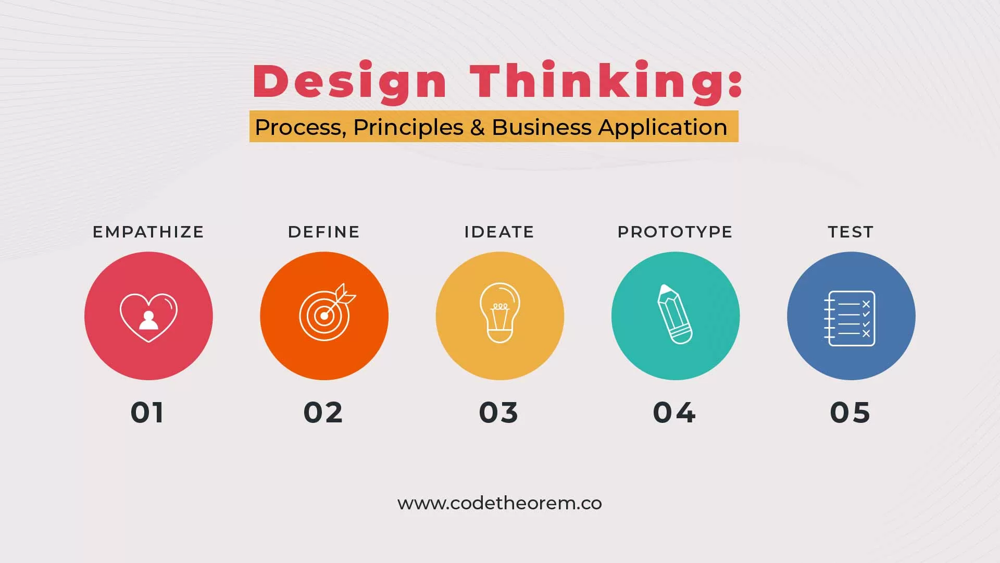

# 24. Innovative Customer Service Practices

## 1. Introduction to Innovative Customer Service Practices

- Innovative customer service practices represent the creative application of novel ideas, technologies, and approaches to enhance the customer experience and drive business success. Innovation in customer service goes beyond traditional methods to meet evolving customer expectations and solve emerging challenges.

- The importance of innovation in customer service cannot be overstated. It serves as a catalyst for differentiation in a competitive landscape, enabling businesses to stand out by offering unique and memorable experiences. Innovative practices have the potential to transform customer interactions, leading to increased satisfaction, loyalty, and advocacy. Moreover, they can drive operational efficiencies, reduce costs, and foster sustainable growth.

- By fostering a culture of innovation, organizations can unlock new opportunities for growth and adaptability. Experimentation, agility, and risk-taking are essential components of this culture, empowering teams to explore unconventional ideas, iterate rapidly, and learn from failures. Embracing innovation encourages continuous improvement and ensures that businesses remain responsive to changing customer needs and market dynamics.

## 2. Implementing Creative Solutions for Common Issues

Implementing Creative Solutions for Common Issues

### a. Problem-Solving Mindset

- Encouraging service teams to approach customer issues with a problem-solving mindset

- Empowering employees to take ownership of problems and explore unconventional solutions

### b. Design Thinking Principles

- Applying design thinking principles to understand customer pain points and ideate innovative solutions

- Conducting empathy interviews and customer journey mapping exercises to gain insights into customer needs and preferences

### c. Co-Creation with Customers

- Involving customers in the co-creation process by soliciting feedback, ideas, and suggestions

- Collaborating with customers to develop customized solutions tailored to their specific requirements

### d. Technology Integration

- Leveraging emerging technologies such as artificial intelligence, chatbots, and automation to streamline customer service processes

- Implementing self-service options and intuitive interfaces to empower customers to resolve issues independently

## 3. Encouraging Out-of-the-Box Thinking

a. Cultivating a Culture of Innovation: Establish an organizational culture that values and rewards innovation. Encourage employees to take calculated risks and explore unconventional ideas. Recognize and celebrate innovative thinking to reinforce its importance within the company.

b. Cross-Functional Collaboration: Break down silos and encourage collaboration across departments and teams. Diverse perspectives can lead to fresh insights and innovative solutions. Create opportunities for interdisciplinary collaboration through joint projects, workshops, or innovation hubs.

c. Brainstorming and Ideation Sessions: Organize regular brainstorming sessions and ideation workshops to generate creative ideas. Provide a supportive environment where employees feel comfortable sharing and exploring their ideas without fear of judgment. Encourage wild ideas and build upon them collaboratively to uncover innovative solutions.

d. Continuous Learning and Development: Invest in ongoing training and development programs to nurture employees' innovation skills. Offer workshops, seminars, and online courses focused on creativity, problem-solving, and design thinking. Encourage employees to explore new ideas and emerging trends outside of their immediate field of expertise.

## 4. Best Practices for Implementing Innovative Customer Service Practices 

- Implementing innovative customer service practices requires a strategic approach that prioritizes leadership support, experimentation, customer-centricity, and scalability. Here are some best practices to consider:

**__a. Leadership Support and Alignment:__** 

Gain buy-in from senior leadership by demonstrating the value and strategic importance of innovation in customer service. Ensure that innovation initiatives are aligned with the organization's goals and objectives. Establish clear metrics and key performance indicators (KPIs) to measure the success of innovation efforts.

**__b. Experimentation and Iteration:__** 

Embrace an agile approach to innovation by encouraging experimentation and rapid iteration. Create a culture where employees feel empowered to test new ideas and take calculated risks. Emphasize the importance of learning from failures and using feedback to refine and improve solutions over time.

**__c. Customer-Centricity:__**

Keep the customer at the center of the innovation process by prioritizing their feedback and insights. Engage with customers regularly to understand their needs, pain points, and preferences. Solicit feedback early and often to validate ideas and ensure that innovative solutions address real customer problems.

**__d. Scalability and Sustainability:__**

Evaluate the scalability and long-term sustainability of innovative solutions before implementation. Consider factors such as cost-effectiveness, resource requirements, and potential impact on the overall customer experience. Ensure that innovative practices can be easily scaled across the organization and maintained over time.

## 5. Case Studies and Examples

**__a. Success Stories:__**

__Zappos:__ Zappos, an online shoe and clothing retailer, is renowned for its innovative customer service approach. They offer free shipping and returns, a 365-day return policy, and 24/7 customer support. Zappos' commitment to customer satisfaction has earned them a loyal customer base and contributed to their business growth.

__Ritz-Carlton:__ Ritz-Carlton hotels are known for their legendary customer service. They empower employees to go above and beyond to delight guests. For example, a guest at a Ritz-Carlton hotel once left behind a stuffed giraffe. The hotel staff not only located the giraffe but also sent it back to the guest along with a photo album documenting the giraffe's "extended stay" at the hotel.

**__b. Creative Solutions:__**

__Domino's Pizza:__ Domino's Pizza introduced the Domino's Tracker, a real-time pizza tracking system that allows customers to track the status of their order from preparation to delivery. This innovative solution enhances transparency and keeps customers informed, reducing anxiety about order status.

__JetBlue:__ JetBlue implemented a proactive social media strategy to provide personalized customer service. They monitor social media channels for mentions of their brand and respond promptly to customer inquiries and feedback. This approach has helped JetBlue build strong customer relationships and enhance brand loyalty.

**__c. Lessons Learned:__**

__Amazon:__ Amazon's relentless focus on innovation and customer-centricity has been key to its success. By constantly experimenting with new technologies and services, Amazon has revolutionized the retail industry and set a high bar for customer service excellence.

__Apple:__ Apple's customer service strategy emphasizes simplicity, efficiency, and empathy. Apple Store employees are trained to provide personalized assistance and support, creating memorable customer experiences that drive loyalty and advocacy.

## 6. Challenges and Considerations in Implementing Innovation in Customer Service
 
- Resistance to Change: Employees and stakeholders may resist adopting new practices or technologies due to fear of the unknown or concerns about disruption to existing workflows. Overcoming resistance requires effective change management strategies and clear communication about the benefits of innovation.

**__Culture of Experimentation:__**

Fostering a culture of experimentation and risk-taking is essential for innovation. However, organizations may struggle to create an environment where failure is accepted as part of the learning process. Encouraging experimentation requires leadership support, open communication, and recognition of innovative efforts.

**__Resource Constraints:__** Limited resources, such as budget and manpower, can pose challenges to innovation initiatives. Organizations must prioritize and allocate resources effectively, balancing short-term operational needs with long-term innovation goals. Collaboration with external partners or leveraging open innovation platforms can also help overcome resource constraints.

**__Regulatory and Compliance Considerations:__** Implementing new technologies or solutions may raise regulatory and compliance concerns, especially in industries with strict data privacy or security requirements. Organizations must ensure that innovative practices comply with relevant laws and regulations and prioritize data protection and security in their innovation efforts.

**__Customer Acceptance:__** Introducing innovative changes to customer service processes or offerings may not always be well-received by customers. Organizations must carefully consider customer feedback and preferences when implementing innovation, ensuring that changes enhance, rather than detract from, the customer experience.

## 7. Future Trends in Innovative Customer Service Practices
   
- **Integration of Emerging Technologies:** Augmented reality (AR), virtual reality (VR), and blockchain are reshaping the customer service landscape. AR and VR offer immersive experiences for product demonstrations, troubleshooting, and training, while blockchain technology enhances security and transparency in transactions and data management.

- **Sustainability and Ethical Considerations:** As environmental and social concerns gain prominence, organizations are incorporating sustainability and ethical considerations into their innovation efforts. This includes adopting eco-friendly practices, reducing carbon footprint, and promoting social responsibility throughout the customer journey.

- **Customer-Centric Approaches:** Customer-centric innovation methodologies, such as co-creation and participatory design, are gaining traction. By involving customers directly in the innovation process, organizations can better understand their needs, preferences, and pain points, leading to more relevant and impactful solutions.

- **Predictive and Personalized Experiences:** Leveraging data analytics and artificial intelligence, organizations are moving towards predictive and personalized customer service experiences. By analyzing customer behavior and preferences, companies can anticipate needs, tailor recommendations, and deliver proactive support, enhancing overall satisfaction and loyalty.

- **Integrated Omnichannel Experiences:** The integration of omnichannel communication channels, including social media, messaging apps, and voice assistants, enables seamless and consistent customer interactions across multiple touchpoints. By providing cohesive experiences across channels, organizations can enhance convenience, accessibility, and engagement for customers.
